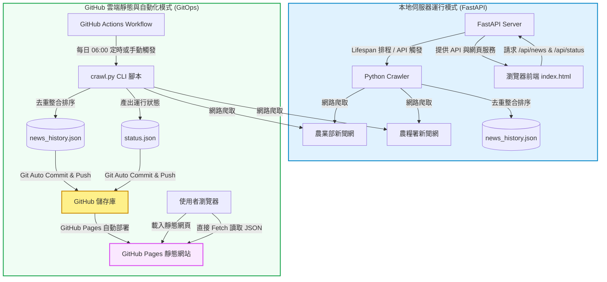

# 農業與農糧署新聞排程匯整系統

> 🌟 **線上展示網址**：[https://mdbenshow-art.github.io/NEWS/](https://mdbenshow-art.github.io/NEWS/)

本專案是一個兼具**本地伺服器運作**與 **GitHub 雲端自動化 (GitOps) 部署**的農業新聞爬蟲與去重整合系統。負責每日定時爬取**農業部**與**農糧署**的最新新聞，並提供美觀的玻璃擬態 (Glassmorphism) 前端介面供瀏覽。

---

## 📊 系統架構與資料流 (System Architecture)

以下為本系統的運作架構圖，展示了「本地運行」與「GitHub Actions 雲端自動化」雙重模式的資料流向：



---

## ✨ 核心特色

1. **雙模運行**：
   * **本地模式**：執行 `python run.py`，開啟 FastAPI Web 伺服器，支援後台執行緒排程與前端即時點擊「重新抓取」。
   * **靜態模式**：部署至 GitHub Pages，完全不需伺服器成本。透過 GitHub Actions 每天在雲端跑爬蟲，並將更新後的資料 commit 回儲存庫。
2. **自動化去重整合**：
   * 爬蟲支援跨分頁爬取以集滿雙邊最新新聞。
   * 自動以新聞唯一連結進行去重，排序採用民國年日期（如 `115-07-07`）由新到舊。
3. **優雅的前端設計**：
   * 採用現代感的 HSL 暗色調與玻璃擬態面板。
   * 提供 **JSON 原生高亮檢視**與**簡潔卡片列表**雙視圖。
   * 支援**來源篩選**與**關鍵字即時搜尋**。
   * 靜態模式下自動 fallback 讀取 `status.json`，在網頁上完美呈現最後更新時間。

---

## 🛠️ 本地快速開始

### 1. 一鍵安裝並啟動
在專案根目錄下直接執行：
```bash
python run.py
```
腳本會自動建立 `.venv` 虛擬環境、安裝依賴套件並啟動服務，同時自動在瀏覽器開啟 `http://127.0.0.1:8000`。

### 2. 僅執行爬蟲 (無伺服器模式)
若您只想手動更新本地 JSON 檔案，不想啟動伺服器：
```bash
# Windows
.venv\Scripts\python.exe crawl.py

# macOS / Linux
.venv/bin/python crawl.py
```

---

## 🚀 GitHub Actions 部署指南

若想將本專案設為自動更新的 GitHub Pages 網站，請參考 [walkthrough.md](file:///C:/Users/User/.gemini/antigravity-ide/brain/0f6d6e17-b84a-4f6d-91f0-399c35aff8ee/walkthrough.md) 的詳細說明。主要步驟如下：
1. 將專案 Push 至 GitHub。
2. 進入儲存庫 **Settings** -> **Actions** -> **General**，將 **Workflow permissions** 改為 **Read and write permissions**。
3. 進入 **Settings** -> **Pages**，將部署源設為 `main` 分支的 `/ (root)`。
